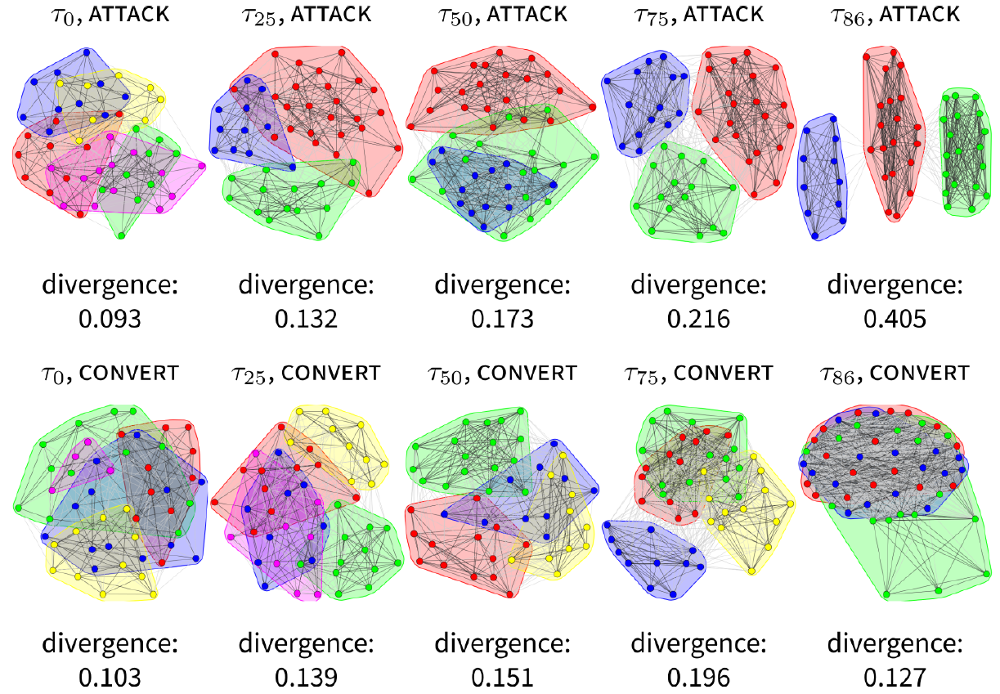
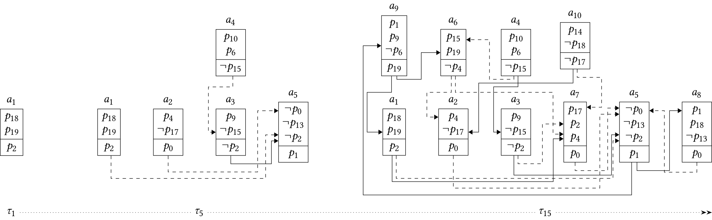
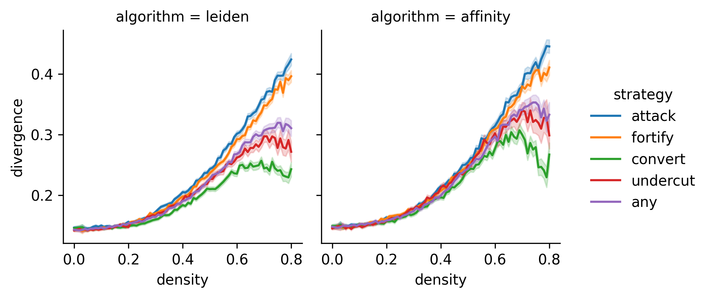

Polarisation is one of the most interesting aspects of deliberating agents. A population that polarises it not just in disagreement, but splits into internally cohesive but externally divergent groups. Contributors to polarisation, how it could be mitigated, and how it is to be measured are presently studied in many disciplines, including sociology and philosophy. This project is a contribution to that endeavour with the tools of computational argumentation theory. The results suggest that argumentation can drive polarisation dynamics on its own, which is a further reason to think that polarisation of beliefs can unfold even if all agents behave epistemically rational.

## How the simulations work
At the heart of this project is an agent-based debate model based on the theory of dialectical structures (TDS, Betz 2009). In this model, agents argue about a finite sentence pool. Each agent is equipped with a belief system in which it assigns a truth value to each sentence under discussion. Agents interact with the world and other agents by introducing arguments, updating their belief system following argument introduction by other agents, and (optionally) by introducing new sentences to the debate. 

### Agent behaviour

Agents introduce arguments following one of five argumentation strategies. To illustrate just two, with the *convert* strategy an agent introduces an argument with premises that another agent endorses, but a conclusion that the agent itself accepts. The introducing thus attempts to convince the addressee that premises it already accepts should lead it to believe the conclusion as well. This can cause friction in the belief system of the addressee if it doesn't already accept the conclusion.

A less cooperative strategy is the *attack* strategy: the introducing agent selects premises affirmed in its own belief system, and a conclusion that the addressee denies. The introducing agents is thus putting forward reasons to disbelief a proposition accepted by the addressee.

Agents update their belief system in case newly introduced arguments render their stance incoherent. In this case, they always update to a belief system with minimal distance to the one they previously held.

### Initialisation, clustering and measurements
Since the sentence pool in this agent-based debate model is finite, debates cannot continue forever. When they have terminated, the simulation runs are evaluated using two state-of-the-art clustering algorithms, the Leiden algorithm (Traag et al. 2019) and affinity propagation (Frey & Dueck 2007). 

Several polarisation measures are applied to the clustered communities: dispersion (population-wide variance of opinions), group coherence, and group divergence (see Bramson et al. 2016).

Agents are initialised with either random belief systems or pre-configured into clusters so that they start maximally polarised.

## Results

Argumentation drives polarisation dynamics in all variants of the model. But the effect size of incurred polarisation depends on the argumentation strategy. Strategies that take into account the beliefs of others, such as the convert strategy, induce lower levels of polarisation and are better equipped to recover from high initial polarisation. Strategies that only take into account the beliefs of the introducing agents, such as the attack strategy, lead to higher levels of polarisation and are less able to recover from antecedent states of bi-polarisation. (Result from publications (1) and (2))

Argumentation-induced polarisation, as described in this model, is further evidence for the hypothesis of *epistemically rational polarisation* – the hypothesis that groups of agents can polarise amid epistemically rational behaviour. (Result from publication 2)

### Complete belief systems, random debate growth

This first configuration is discussed in publication (1): agents never suspend judgement, the debates grows randomly, and all sentences under discussion are known to the agents when the debates begin.

Two individual model runs are shown in the following figure. The clusterings obtained from the Leiden algorithm are pictured alongside the resulting group divergence measures for two strategies, attack and convert.

Although not all model runs will result in the same levels of clustering and polarisation, these two runs show typical behaviour for the associated strategy: arguments following the convert strategy are well suited to bridging the gap between distant belief systems, whereas the attack strategy tends to emphasise these differences.

### Partial belief systems, tree-like debate growth

Publication (2) makes the model more realistic. First it allows agents to not assign a truth value to a sentence under discussion. Secondly, debates do not grow into random graphs, but grow in a tree-like manner, and thirdly, new sentences can be introduced during the debate.

Tree-like debate growth works by designating a subset of the sentences under discussion as “key statements” of the debate. The argument introduction mechanism is then modified such that conclusions are selected based on the distance to these key statements. In the example below, key statements are p0, p1 and p2. In the first debate stage, τ1, p18 and p19 are selected as premises in an argument with conclusion p2. Now both p18 and p19 in turn have a non-zero chance to be selected as the conclusion of an argument, which eventually happens in argument a9. This algorithm for tree-like debate growth was developed by Betz et al. (2021).

### Polarisation can rise among deliberating agents without irrationality

With the modifications from publication (2), we now have further evidence to think that polarisation can rise even when all agents adhere to epistemically rational norms.

Previous agent-based models implemented agent behaviour with what we could call “limiting factors”: these are factors that limit the agent's capabilities of engaging with the simulated world and other agents. Examples include biased communication based on trust or limited memory. If these factors were absent from previous models, the population failed to polarise. 

The polarisation dynamics of agents initialised with random, partial belief systems that see new sentences added to the debate is shown in the following figure. The figure shows the polarisation measure *group divergence*, based on clusterings obtained from two algorithms. More detailed results are presented in publications (1–2).

## Publications
 1. Kopecky, Felix. 2022. Arguments as drivers of issue polarisation in debates among artificial agents. *Journal of Artificial Societies and Social Simulation* 25(1). DOI: [10.18564/jasss.4767](https://doi.org/10.18564/jasss.4767).

 2. Kopecky, Felix. 2024. Argumentation-induced rational issue polarisation. *Philosophical Studies* 181 (1), pp. 83-107. DOI: [10.1007/s11098-023-02059-6](https://doi.org/10.1007/s11098-023-02059-6)

## References
Betz, Gregor. 2009. Evaluating dialectical structures. *Journal of Philosophical Logic* 38, pp. 283–312. DOI: [10.1007/s10992-008-9091-5](https://doi.org/10.1007/s10992-008-9091-5)

Betz, Gregor, Vera Chekan & Tamara Mchedlidze. 2021. Heuristic algorithms for the approximation of mutual coherence. (Manuscript)

Bramson, Aaron, Patrick Grim, Daniel J. Singer, Steven Fisher, William Berger, Graham Sack & Carissa Flocken. 2016. Disambiguation of social polarization concepts and measures. *The Journal of Mathematical Sociology* 40 (2), pp. 80-111, DOI: [10.1080/0022250X.2016.1147443](https://doi.org/10.1080/0022250X.2016.1147443).

Frey, Brendan J. & Delbert Dueck (2007). Clustering by passing messages between data points. *Science* 315 (5814), pp. 972–976. DOI: [10.1126/science.1136800](https://doi.org/10.1126/science.1136800).

Traag, Vincent A., Ludo Waltman & Nees J. van Eck 2019. From Louvain to Leiden: Guaranteeing well-connected communities. *Scientific Reports*, 9 (5233). DOI: [10/gfxg2v](https://doi.org/10/gfxg2v).

## Contact
For inquiries about the project, contact Felix Kopecky at <f.kopecky@kit.edu>.