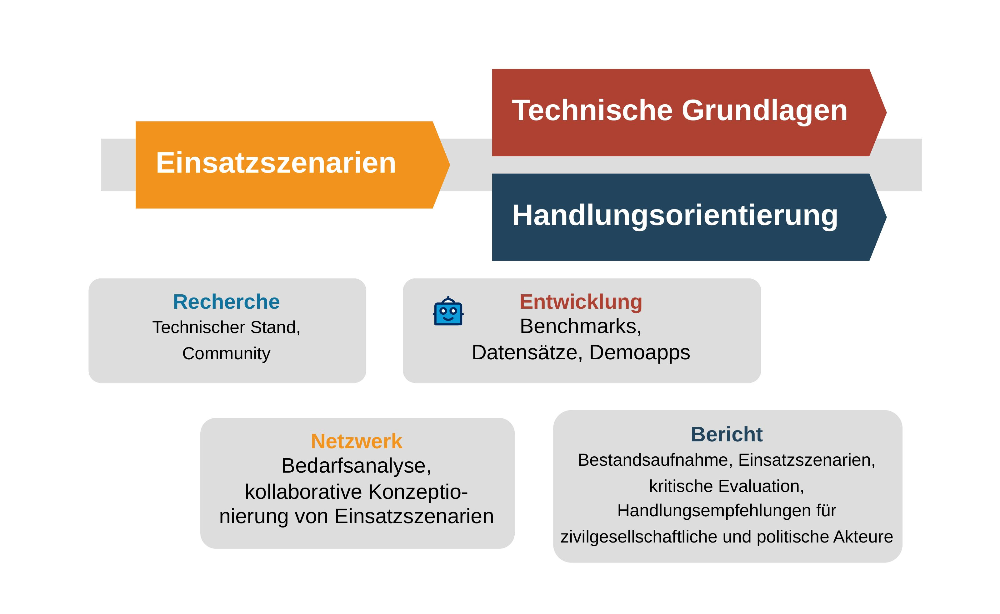

In the **_KIdeKu_** project, we explored the question of how Large Language Models (LLMs) such as ChatGPT can be used to strengthen our deliberative culture. What opportunities do these technologies offer to improve our democratic practice? More specifically:

+ How can LLMs be used to improve the quality of public discourse? 
+ Which current problems (disinformation, hate speech, ...) can be addressed through the use of LLMs? 
+ What requirements must be met for the successful use of LLMs? 
+ Which concrete application scenarios are promising for a positive contribution of LLMs to deliberative culture? 
+ How can we strengthen political participation through LLMs?
  + For which target groups is the use of LLMs particularly promising? 
  + What particular challenges does the target group of young people pose? 
+ ...

<!-- Ziele -->
## Goals & procedure

1. 👥 **Development of deployment scenarios:** In consultation with civil society actors, we designed relevant and novel deployment scenarios. We wanted to create a broad overview of how LLMs can be used in our democratic practice for the common good and of the goals that can be pursued with them. We considered different requirements by civil society organizations for the use and integration of LLM-based applications as well as the needs of the various target groups. Examples of such application scenarios include:
   + Fact checkers, hate speech detectors, AI assistance in writing speeches, (partially) automated moderation in online debates, debate summarization, argumentation explanation, argument checking, ... 
2. 🤖 **Creation of technical foundations:** For some of the conceptualized deployment scenarios, we developed technical foundations that can be used and further developed by the community. These foundations include:
   + **Requirements** that can be used to systematically test the suitability of language models for the intended use. These requirements can be operationalized in the form of deliberative benchmarks (test data sets).
   **Demo apps** that illustrate the use of LLMs and can be the starting point for the development of ready-to-use apps. 
3. 📋 **Action orientation:** A final report summarizes the current state of knowledge on the use of LLMs in deliberative democracies to strengthen our deliberative culture, compiles project results and formulates recommendations and best practices for civil society and political actors.

Overall, in **_KIdeKu_** we developed concepts and studies to create a suitable operational framework for the development and use of AI for the common good in our democratic practice. We hope that the results and ideas will be taken up and further developed. 

## Outcomes

### 🕵️‍♀️ EvidenceSeeker Boilerplate

A code template for building AI-based apps that fact-check statements against a given knowledge base.

📖 Docs: <https://debatelab.github.io/evidence-seeker/>

📊 Example results: <https://debatelab.github.io/evidence-seeker-results/>

🧩 Code: <https://github.com/debatelab/evidence-seeker>

🤗 Gradio DemoApp: <https://huggingface.co/spaces/DebateLabKIT/evidence-seeker-demo>

### 📣 Toxicity Detektor 

An LLM-based pipeline to detect toxic speech.

🧩 Code: <https://github.com/debatelab/toxicity-detector>

### syncIALO 🤖🗯️

**Syn**theti**c** drop-in replacements for [_K**ialo**_](https://kialo.com) debate datasets.

🧩 Code: <https://github.com/debatelab/syncIALO>

<!--
### 📋 Report

-->
---
*Project duration:* 01.06.2024--31.12.2025


