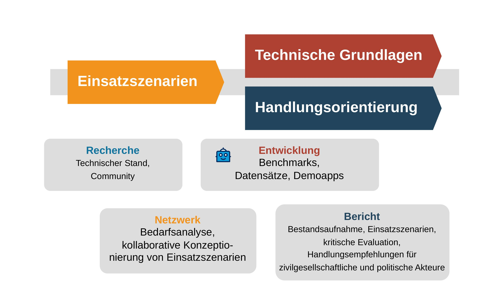

Im Projekt **_KIdeKu_** gehen wir der Frage nach, wie Large Language Models (LLMs) wie bspw. ChatGPT benutzt werden können, um unsere deliberative Kultur zu stärken. Welche Chancen bieten diese Technologien zur Verbesserung unserer demokratischen Praxis? Konkreter:

+ Wie können LLMs benutzt werden, um die Qualität des öffentlichen Diskurses zu verbessern? 
+ Welche derzeitigen Probleme (Desinformation, Hassrede, ...) können durch die Verwendung von LLMs adressiert werden? 
+ Welche Voraussetzungen müssen für einen erfolgreichen Einsatz von LLMs erfüllt sein? 
+ Welche konkreten Einsatzszenarien sind vielversprechend für einen positiven Beitrag von LLMs zur deliberativen Kultur? 
+ Wie können wir politische Teilhabe durch LLMs stärken?
  + Für welche Zielgruppen ist der Einsatz von LLMs besonders aussichtsreich? 
  + Welche besonderen Herausforderungen stellt die Zielgruppe junger Menschen? 
+ ...

<!-- Ziele -->
## Ziele & Vorgehen

Für die Beantwortung dieser Leitfragen wollen wir in **_KIdeKu_** zivilgesellschaftliche Akteur:innen in unseren Forschungs- und Entwicklungsprozess einbinden und unsere Resultate für die Verwendung und Weiterentwicklung offen kommunizieren und frei verfügbar machen. 

{}
🙋 Ihr habt Input, Ideen und wollt Euch in diesem Prozess einbringen? 👏 Dann meldet Euch bei uns! 👉 [📧](mailto:kideku.kit.edu)
{}

Wie streben die folgenden Ziele an: 

1. 👥 **Entwicklung von Einsatzszenarien:** In Abstimmung mit zivilgesellschaftlichen Akteur:innen konzipieren wir relevante und neuartige Einsatzszenarien. Wir wollen einen möglichst breiten Überblick darüber schaffen, wie LLMs gemeinwohlorientiert in unserer demokratischen Praxis verwendet werden können und welche Ziele damit verfolgt werden können. Es sollen sowohl die Anforderungen zivilgesellschaftlicher Organisationen an die Verwendung und Einbindung LLM-basierter Applikationen als auch die Bedarfe der unterschiedlichen Zielgruppen erfasst werden. Beispiele für solche Einsatzszenarien umfassen:
   + Faktenprüfer, Hate Speech Detektoren, KI-Assistenz beim Verfassen von Redebeiträgen, (partiell) automatisierte Moderation in Onlinedebatten, Debattenzusammenfassung, Argumentationserklärung, Argumentprüfung, ... 
2. 🤖 **Schaffung technischer Grundlagen:** Für einige der konzeptionierten Einsatzszenarien entwickeln wir technische Grundlagen, die von der Community benutzt und weiterentwickelt werden können. Diese Grundlagen umfassen:
   + **Anforderungen**, anhand derer sich die Eignung von Sprachmodellen für den vorgesehenen Einsatz systematisch prüfen lässt. Diese Anforderungen werden in Form deliberativer Benchmarks (Testdatensätze) operationalisiert. Die gängigsten bestehenden Sprachmodelle werden daraufhin anhand der erstellten Benchmarks evaluiert.
   + **Demoapps**, die den Einsatz von LLMs illustrieren und Ausgangspunkt für die Entwicklung einsatzbereiter Apps darstellen können. 
3. 📋 **Handlungsorientierung:** Ein Endbericht fasst den derzeitigen Wissensstand zur Nutzung von LLMs in deliberativen Demokratien zur Stärkung unserer deliberativen Kultur zusammen, trägt Projektergebnisse zusammen und formuliert Empfehlungen und Best Practices für zivilgesellschaftliche und politische Akteur:innen.

Insgesamt erarbeiteten wir in **_KIdeKu_** damit Konzepte und Studien zur Schaffung eines geeigneten operativen Rahmens für die Entwicklung und den Einsatz gemeinwohlorientierter KI in unserer demokratischen Praxis und hoffen, dass die Ergebnisse und Ideen aufgegriffen sowie weiterentwickelt werden. 

---
*Projektlaufzeit:* 01.06.2024--31.12.2025

*Gefördert vom:*
<!--  -->
